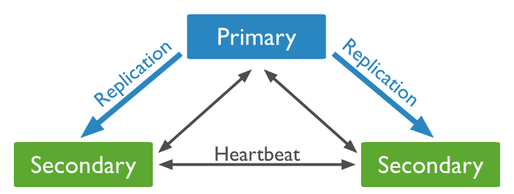

# projet_data354_ETL
construction d'une ETL (extraction, traitement, chargement)  automatisée pour extraire,
traiter et charger les données enregistrées par des capteurs via l'API de la plateforme arquino

# I-STRUCTURE DU PROJET

- Dossier **Images** contenant les images extraites de la plateforme apache superset
- station.avg_stat_hour1.csv: fichier csv contenant le CO et le PM2.5 moyen par jour du capteur 1. ("station_id" = 283164601)
- station.avg_stat_hour2.csv: fichier csv contenant le CO et le PM2.5 moyen par jour du capteur 2.("station_id" =283181971)
- Ext_Tran_load.py: script python qui contient trois fonction, une pour  l'extraction de données, une pour le traitement et une troisieme pour le charger les données dans une base de données de mongodb . Dans le meme fichier sont appelées ces differentes fonctions suivant une logique bien definie. De plus il a été mis en place un processus assez simple  d'automatisation de mon ETL grace au module time de python. 
- requirement.txt: contient les dependances necessaire pour le bon fonctionnement du programme python avec execution

# II- Fonctionnement du code

Pour ce lui ci marche correctement, il faut :
## II-1 Mise en place d'un cluster mongodb avec docker ou sans

    **. Avec docker**
- telecharger **docker engine** ou **docker desktop** fonction du systeme d'exploitation que l'on utilise
- mettre en place un cluster(facultatif) mais dans ce projet jai mis en place un replicaset de trois noeuds comme suit:
    - ouvrir un terminal linux ou un cmd et execute respectivement les commandes
        1-creation du reseau:

            docker network create mongoCluster

        2- creation du premier conteneur mongo avec docker:

            docker run -d -p 27017:27017 --name mongo1 --network mongoCluster mongo:5 mongod --replSet myReplicaSet --bind_ip localhost,mongo1

        3- creation du premier conteneur mongo avec docker

            docker run -d -p 27018:27017 --name mongo2 --network mongoCluster mongo:5 mongod --replSet myReplicaSet --bind_ip localhost,mongo2
        4- 
            docker run -d -p 27019:27017 --name mongo3 --network mongoCluster mongo:5 mongod --replSet myReplicaSet --bind_ip localhost,mongo3
        
        5- initialisation de mon replicaset:

            docker exec -it mongo1 mongosh --eval "rs.initiate({
             _id: \"myReplicaSet\",
                 members: [
            {_id: 0, host: \"mongo1\"},
             {_id: 1, host: \"mongo2\"},
             {_id: 2, host: \"mongo3\"}
             ]
            })"

    **. sans docker en dur sur le PC**
        1- Aller sur :
            https://www.mongodb.com/try/download/community
        2- Ensuite demarrer le server mongod en local sur le port 27017 

    **. Avec mongo atlas sur le cloud**
        - Aller sur ce site 
        https://www.mongodb.com/atlas/database

    Vous pouvez faire : docker ps  pour voir si vos conteneur sont actifs
**NB:** Ajouter le port du noeud primaire a l'endroit indiqué dans le script python **Ext_Tran_load.py**

## II-2 Installation des dependances

    Pour ce faire, utiliser la commande :

        pip install -r requirements.txt

## II-3 Quelques images 

    

    

    

# IV- Reponses aux questions

## 1. Quelle serait votre stratégie de mise en production de votre ETL?

La stratégie de mise en production de l'ETL (Extract, Transform, Load) doit être bien planifiée pour garantir un fonctionnement stable et fiable du système. Voici une stratégie générale en plusieurs étapes :

    Effectuer des tests complets dans  l'environnement pour valider le bon fonctionnement de l'ensemble du flux ETL.
        
    Automatiser les tests pour la vérification continue de l'intégrité du système.
    Incluez des tests unitaires, des tests de performance, des tests de charge et des tests d'acceptation.

    Utiliser Git pour la gestion de versions du code source de l'ETL.
    Adopter une approche de gestion de branches pour permettre le développement continu tout en maintenant la stabilité de la branche principale.

    Employer Ansible pour automatiser le déploiement du système en production.
    Établissez des playbooks Ansible détaillés pour déployer les composants de l'ETL, configurer l'environnement et effectuer des tâches post-déploiement.

    Mettre en place des outils de surveillance pour suivre les performances, détecter les erreurs et assurer une réactivité immédiate en cas de problèmes.
    Intégrez des alertes pour être informé de manière proactive des incidents.

    Si la charge de travail augmente, utilisez docker + Kubernetes pour le scaling automatique et dynamique des composants de l'ETL.
    Configurez les pods Kubernetes pour répondre aux besoins de charge en temps réel.

## 2. Quelle serait votre stratégie pour que declencher votre ETL automatiquement chaque heure ?

Ma strategie pour le moment est toute simple, car n'ayant pas encore toucher reellement du doigt tous ces outils sofistiqués d'automatisation d'un ETL telque **airflow**, il m'est difficile de les choisir comme outils pour implementer ma sulution. Par contre je ferai quelle que chose d'assez simple comme par exemple utiliser le module **time** de python qui me permet de le faire simplement en utilisant la focntion **sleep** de ce module la. D'ailleurs, c'est ce que j'ai dans le cadre de ce projet pour que mon ETL  se dechenche toutes les heures.

    - Evolution du chargement en image quelques heures apres le lancement du script python
             